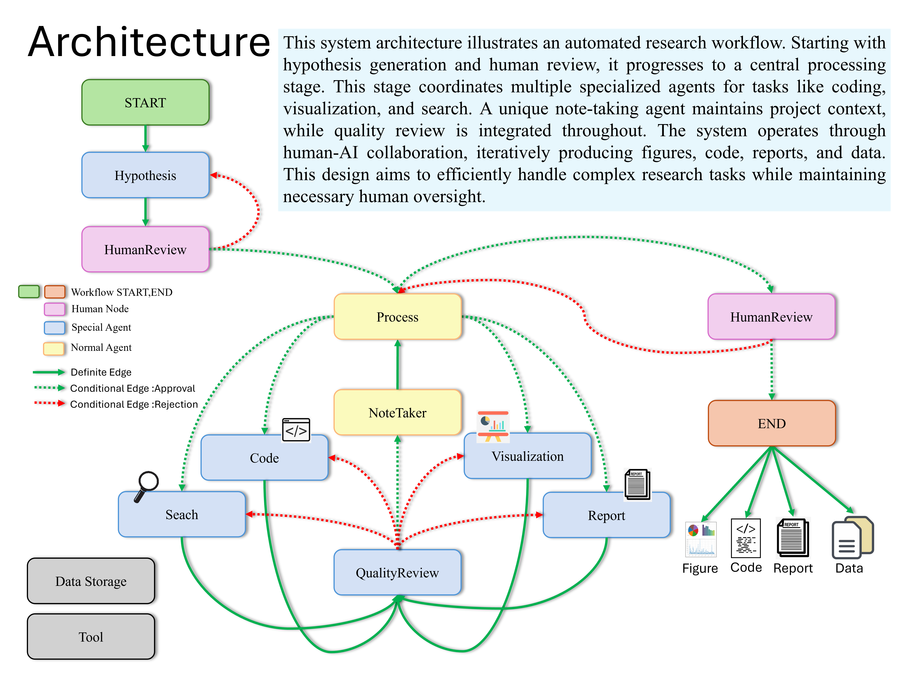

# AI-Driven Research Assistant



## Overview

This is an advanced AI-powered research assistant system that utilizes multiple specialized agents to assist in tasks such as data analysis, visualization, and report generation. The system employs LangChain, OpenAI's GPT models, and LangGraph to handle complex research processes, integrating diverse AI architectures for optimal performance.

## Key Features

- Hypothesis generation and validation
- Data processing and analysis
- Visualization creation
- Web search and information retrieval
- Code generation and execution
- Report writing
- Quality review and revision
- **Diverse Architectural Integration**: 
  - Supervisor agents for overseeing the analysis process
  - Chain-of-thought reasoning for complex problem-solving
  - Critic agents for quality assurance and error checking
- **Innovative Note Taker Agent**: 
  - Continuously records the current state of the project
  - Provides a more efficient alternative to transmitting complete historical information
  - Enhances the system's ability to maintain context and continuity across different analysis stages
- **Adaptive Workflow**: Dynamically adjusts its analysis approach based on the data and task at hand

## Why It's Unique

The integration of a dedicated Note Taker agent sets this system apart from traditional data analysis pipelines. By maintaining a concise yet comprehensive record of the project's state, the system can:

1. Reduce computational overhead
2. Improve context retention across different analysis phases
3. Enable more coherent and consistent analysis outcomes

## System Requirements

- Python 3.10 or higher
- Jupyter Notebook environment

## Installation

1. Clone the repository:
```bash
git clone https://github.com/starpig1129/ai-data-analysis-MulitAgent.git
```
2. Create and activate a Conda virtual environment:
```bash
conda create -n data_assistant python=3.10
conda activate data_assistant
```
3. Install dependencies:
```bash
pip install -r requirements.txt
```
4. Set up environment variables:
**Rename `.env Example` to `.env` and fill all the values**
```sh
# Your data storage path(required)
DATA_STORAGE_PATH =./data_storage/

# Anaconda installation path(required)
CONDA_PATH = /home/user/anaconda3

# Conda environment name(required)
CONDA_ENV = envname

# ChromeDriver executable path(required)
CHROMEDRIVER_PATH =./chromedriver-linux64/chromedriver

# Firecrawl API key (optional)
# Note: If this key is missing, query capabilities may be reduced
FIRECRAWL_API_KEY = XXXXXXXXXXXXXXXXXXXXXXXXXXXXXXXXXXXX

# OpenAI API key (required)
# Warning: This key is essential; the program will not run without it
OPENAI_API_KEY = XXXXXXXXXXXXXXXXXXXXXXXXXXXXXXXXXXXX

# LangChain API key (optional)
# Used for monitoring the processing
LANGCHAIN_API_KEY = XXXXXXXXXXXXXXXXXXXXXXXXXXXXXXXXXXXX
```
## Usage

1. Start Jupyter Notebook:

2. Set YourDataName.csv in data_storage

3. Open the `main.ipynb` file.

4. Run all cells to initialize the system and create the workflow.

5. In the last cell, you can customize the research task by modifying the `userInput` variable.

6. Run the final few cells to execute the research process and view the results.

## Main Components

- `hypothesis_agent`: Generates research hypotheses
- `process_agent`: Supervises the entire research process
- `visualization_agent`: Creates data visualizations
- `code_agent`: Writes data analysis code
- `searcher_agent`: Conducts literature and web searches
- `report_agent`: Writes research reports
- `quality_review_agent`: Performs quality reviews
- `note_agent`: Records the research process

## Workflow

The system uses LangGraph to create a state graph that manages the entire research process. The workflow includes the following steps:

1. Hypothesis generation
2. Human choice (continue or regenerate hypothesis)
3. Processing (including data analysis, visualization, search, and report writing)
4. Quality review
5. Revision as needed

## Customization

You can customize the system behavior by modifying the agent creation and workflow definition in `main.ipynb`.

## Notes

- Ensure you have sufficient OpenAI API credits, as the system will make multiple API calls.
- The system may take some time to complete the entire research process, depending on the complexity of the task.
- **WARNING**: The agent system may modify the data being analyzed. It is highly recommended to backup your data before using this system.
## Current Issues and Solutions
1. OpenAI Internal Server Error (Error code: 500)
2. NoteTaker Efficiency Improvement
3. Overall Runtime Optimization
4. Refiner needs to be better
## Contributing

Pull requests are welcome. For major changes, please open an issue first to discuss what you would like to change.

## License

This project is licensed under the MIT License - see the [LICENSE](LICENSE) file for details.

## Star History

[](https://star-history.com/#starpig1129/Multi-agent-DataAnalysis&Date)

## Other Projects
Here are some of my other notable projects:
### ShareLMAPI
ShareLMAPI is a local language model sharing API that uses FastAPI to provide interfaces, allowing different programs or device to share the same local model, thereby reducing resource consumption. It supports streaming generation and various model configuration methods.
- GitHub: [ShareLMAPI](https://github.com/starpig1129/ShareLMAPI)
### PigPig: Advanced Multi-modal LLM Discord Bot: 
A powerful Discord bot based on multi-modal Large Language Models (LLM), designed to interact with users through natural language. 
It combines advanced AI capabilities with practical features, offering a rich experience for Discord communities.
- GitHub: [ai-discord-bot-PigPig](https://github.com/starpig1129/ai-discord-bot-PigPig)