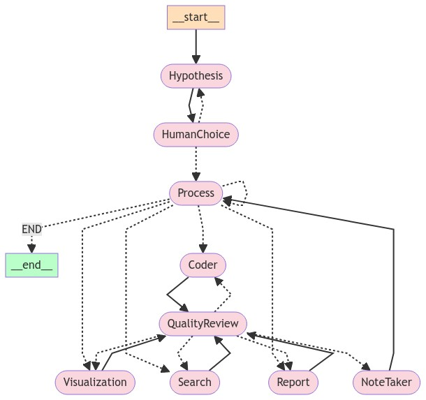

# AI-Driven Research Assistant



## Overview

This is an AI-powered research assistant system that utilizes multiple specialized agents to assist in tasks such as data analysis, visualization, and report generation. The system employs LangChain, OpenAI's GPT models, and LangGraph to handle complex research processes.

## Features

- Hypothesis generation and validation
- Data processing and analysis
- Visualization creation
- Web search and information retrieval
- Code generation and execution
- Report writing
- Quality review and revision

## System Requirements

- Python 3.10 or higher
- Jupyter Notebook environment

## Installation

1. Clone the repository:
```bash
git clone [https://github.com/starpig1129/Multi-agent-DataAnalysis.gitL]
```
2. Install dependencies:
```bash
pip install -r requirements.txt
```
3. Set up environment variables:
**Rename `.env Example` to `.env` and fill all the values**
```sh
DATA_STORAGE_PATH =./data_storage/

CONDA_PATH = /home/user/anaconda3

CONDA_ENV = envname
CHROMEDRIVER_PATH =./chromedriver-linux64/chromedriver
FIRECRAWL_API_KEY = XXXXXXXXXXXXXXXXXXXXXXXXXXXXXXXXXXXX

OPENAI_API_KEY = XXXXXXXXXXXXXXXXXXXXXXXXXXXXXXXXXXXX
LANGCHAIN_API_KEY = XXXXXXXXXXXXXXXXXXXXXXXXXXXXXXXXXXXX
```
## Usage

1. Start Jupyter Notebook:

2. Open the `main.ipynb` file.

3. Run all cells to initialize the system and create the workflow.

4. In the last cell, you can customize the research task by modifying the `userInput` variable.

5. Run the final few cells to execute the research process and view the results.

## Main Components

- `hypothesis_agent`: Generates research hypotheses
- `process_agent`: Supervises the entire research process
- `visualization_agent`: Creates data visualizations
- `code_agent`: Writes data analysis code
- `searcher_agent`: Conducts literature and web searches
- `report_agent`: Writes research reports
- `quality_review_agent`: Performs quality reviews
- `note_agent`: Records the research process

## Workflow

The system uses LangGraph to create a state graph that manages the entire research process. The workflow includes the following steps:

1. Hypothesis generation
2. Human choice (continue or regenerate hypothesis)
3. Processing (including data analysis, visualization, search, and report writing)
4. Quality review
5. Revision as needed

## Customization

You can customize the system behavior by modifying the agent creation and workflow definition in `main.ipynb`.

## Notes

- Ensure you have sufficient OpenAI API credits, as the system will make multiple API calls.
- The system may take some time to complete the entire research process, depending on the complexity of the task.

## Contributing

Pull requests are welcome. For major changes, please open an issue first to discuss what you would like to change.

## License

This project is licensed under the MIT License - see the [LICENSE](LICENSE) file for details.
